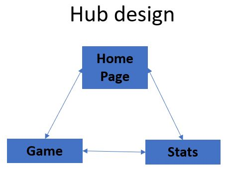
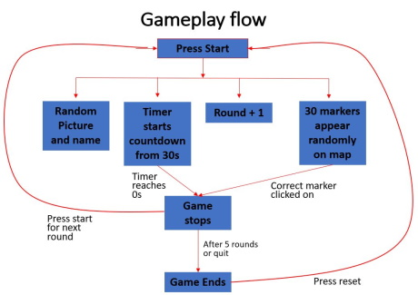
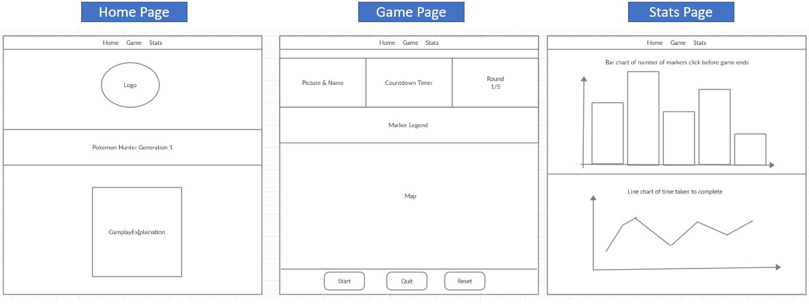
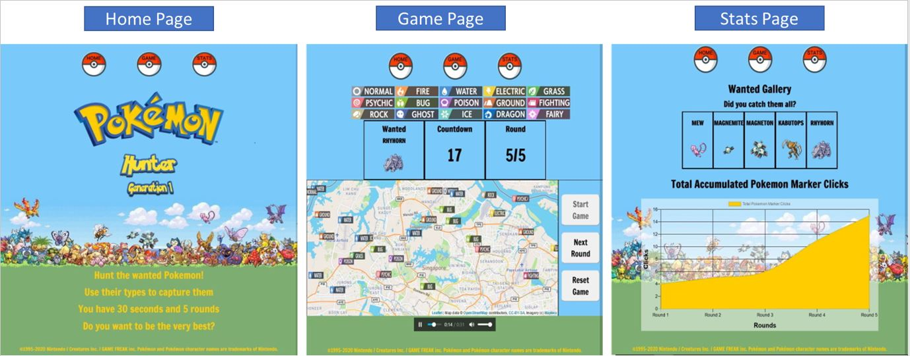
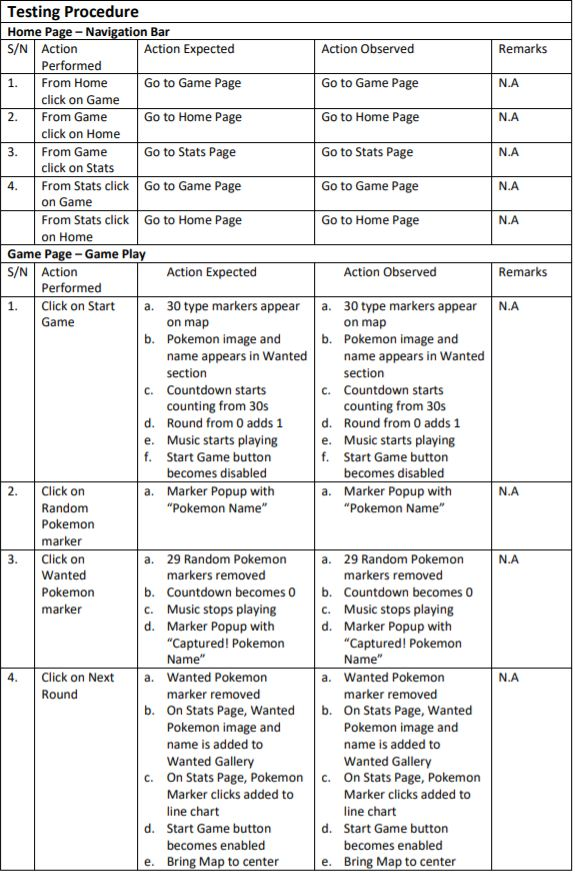
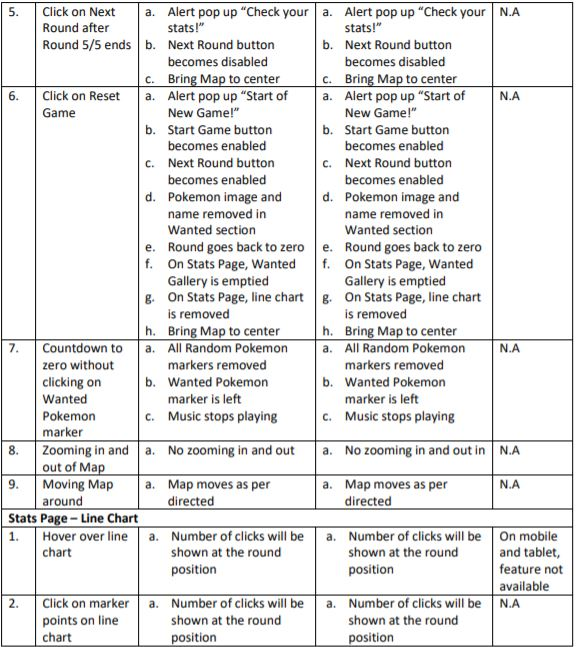

# Pokemon Hunter

## Project 2: Interactive Front-End Development 

### Context
Website is designed for a game in which the user catches a Wanted Pokemon within a time limit base on their type. 30 Random Pokemon markers will be generated on a Leaflet map from a Pokemon API. The goal is to click on the Wanted Pokemon marker within 30 seconds to win the round. 5 rounds will be played before the game has to be reset. The accumulated clicks of the user for the rounds and the Wanted Pokemon will be displayed on the statistic page. 

The website can be accessed  via this link: https://freezefaz.github.io/Project-2-Interactive-Frontend/

## UX

### Strategy
The game is to appeal to Pokemon fans and casual gamers alike. It also takes into the game developer’s point of view.
User story 
- As a Pokemon fan, I would like to play a Pokemon related game that so that I can test my knowledge of Pokemon
- As a casual gamer, I would like to play a quick game that will help me pass the time to cure my boredom
- As a developer, I would like to engage gamers with new concept of gaming to test their success rate in to create a hit game
- As a developer, I would like to get more awareness of my brand by creating games that leverage on popular brands to get more customer and partners

### Scope
Functions required:
-	Nav bar for single page application
-	Card to place pictures
-	Countdown timer
-	Counter for rounds
-	Map to place markers
-	Graphs to display stats

### Structure

The website is designed as a single page application to reduce any latency when switching from pages. It follows a Hub design with 3 buttons to navigate from Home, Game and Stats page and each page can go directly to the desired page from where they are.

The game will begin when the start button is clicked. This will result in the generation of 1 wanted Pokemon marker and 29 random Pokemon markers. These markers will be labeled with their respective Pokémon types. The countdown will be from 30 seconds and the round will increase to 1.
The round ends when the countdown reaches 0 seconds or if the wanted Pokemon is captured. After 5 rounds are completed the game will end. In order to replay the game, click on reset and it will set the rounds back to 0.

### Wireframe

## Features
### Screenshots of completed website

### Existing Features

### Features Left to Implement

## Technologies Used
1. HTML
2. CSS
3. Bootstrap (4.5)
4. GoogleFonts
5. Javascript
6. Leaflet
7. JQuery
8. Ajax
9. Axios
10. Chart JS

## Testing

### Testing Overview
No automated testing was done

Testing of website was done on:

Devices:
1. Samsung S10e
2. Samsung Galaxy Tab S2
3. 14-inch Laptop

Websites:
1. Firefox
2. Chrome
3. Edge

### Testing Procedure

### Known Bugs
- The line chart canvas will encroach into the Home and Game pages if it shrinks from a screen width lesser than 1222px. It seems that the line chart canvas is not media responsive in terms of shrinking.
- There is no issue if the screen expands from a mobile to tablet to laptop. If only have issues if it is shrinking from a bigger device to smaller. On the devices itself there are no issues.

- The random number used for generating Pokemon has its limitations and it surfaces in these scenarios:
- The same Pokemon can appear as both the Wanted and Random Pokemon, hence it may cause confusion as to why the game has not ended or why the Pokemon was not captured.
- The Pokemon Markers may end up getting generated behind one another, hence it may “hide” in between markers making them hard to find and click on.

## Deployment

### Process
- The project is based on Code Institute's template and was cloned upon initialisation to local drive through git clone in the command prompt.
- Gitpod was employed to code the website. Firefox browser was used to preview the website.
- The master branch of the website was deployed through Github.

### Running Code
- Website link is hosted by Github: https://freezefaz.github.io/Project-2-Interactive-Frontend/.
- You can either use the fork function on Github or clone/download button to duplicate the files in master branch. For cloning, type git clone https://github.com/Freezefaz/Project-2-Interactive-Frontend.git in your system's command prompt.
- Use a code editor/IDE such as Visual Studio Code or Gitpod to open the folder and preview the website by running the code.

## Credits

Welcome Freezefaz,

This is the Code Institute student template for Gitpod. We have preinstalled all of the tools you need to get started. You can safely delete this README.md file, or change it for your own project.

## Gitpod Reminders

To run a frontend (HTML, CSS, Javascript only) application in Gitpod, in the terminal, type:

`python3 -m http.server`

